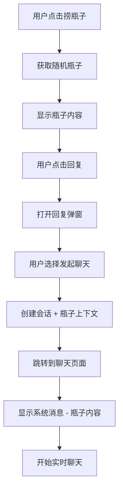

# 🍾 从漂流瓶到聊天的完整流程

## 📋 功能概述

这是一个完整的用户交互流程，从发现漂流瓶开始，到与瓶子作者进行实时聊天。整个流程设计得自然流畅，为用户提供了丰富的社交体验。

## 🎯 完整流程步骤

### 1️⃣ 捞瓶子

**页面**: `/home`
**操作**: 点击"捞瓶子"按钮
**功能**:

- 调用 `pickBottle()` API
- 随机获取一个漂流瓶
- 显示瓶子在海面上漂浮

### 2️⃣ 查看瓶子内容

**页面**: `/home`
**操作**: 点击瓶子或"打开瓶子"按钮
**功能**:

- 展开显示瓶子完整内容
- 支持文本、图片、音频等多媒体内容
- 显示发布时间和匿名作者信息

### 3️⃣ 回复瓶子

**页面**: `/home` (弹窗)
**操作**: 点击"回复"按钮
**功能**:

- 打开 `BottleReplyModal` 回复弹窗
- 显示原始瓶子内容作为上下文
- 提供回复输入框（最多 500 字符）
- 支持发送回复和发起聊天两种选择

### 4️⃣ 发起聊天

**页面**: 回复弹窗
**操作**: 点击"发起聊天"按钮
**功能**:

- 调用 `createConversation()` API
- 创建与瓶子作者的会话
- 传递瓶子内容作为聊天上下文

### 5️⃣ 进入匿名聊天界面

**页面**: `/chat?conversation={id}`
**操作**: 自动跳转
**功能**:

- 自动选择刚创建的会话
- 显示聊天界面
- 加载会话历史

### 6️⃣ 置顶展示回复瓶子的内容

**页面**: `/chat` (ChatWindow 组件)
**位置**: 聊天消息列表顶部
**样式**: 特殊的系统消息样式
**内容**:

```
🍾 关于漂流瓶：

"[原始瓶子内容]"

来自：[作者名字]
```

### 7️⃣ 开始聊天

**页面**: `/chat` (ChatWindow 组件)
**功能**:

- 实时消息收发
- 消息状态显示（已发送 ✓/已读 ✓✓）
- 支持多行文本输入
- Enter 发送，Shift+Enter 换行

## 🔧 技术实现

### API 端点

```typescript
// 捞瓶子
GET /api/bottles/random?userId={userId}

// 回复瓶子
POST /api/bottles/{id}/reply
{
  "userId": "string",
  "content": "string"
}

// 创建会话（带瓶子上下文）
POST /api/chat/conversations
{
  "userId": "string",
  "targetUserId": "string",
  "bottleContext": {
    "content": "string",
    "author": { "firstName": "string" },
    "bottleId": "string"
  }
}

// 获取会话消息
GET /api/chat/conversations/{id}/messages?userId={userId}

// 发送消息
POST /api/chat/conversations/{id}/messages
{
  "userId": "string",
  "content": "string",
  "mediaType": "TEXT"
}
```

### 组件结构

```
app/home/page.tsx                    # 主页 - 捞瓶子和查看
├── components/bottles/BottleCard    # 瓶子卡片组件
├── components/bottles/BottleReplyModal # 回复弹窗组件
└── hooks/useBottleActions           # 瓶子操作hooks

app/chat/page.tsx                    # 聊天页面
├── components/chat/ConversationList # 会话列表
├── components/chat/ChatWindow       # 聊天窗口
└── hooks/useChatActions             # 聊天操作hooks
```

### 数据流



## 🎨 UI/UX 特色

### 海洋主题一致性

- 使用统一的 `ocean-button`、`bottle-card` CSS 类
- 波纹背景效果贯穿整个流程
- 蓝色渐变配色方案

### 流畅动画效果

- 瓶子漂浮动画 (`animate-float`)
- 页面切换过渡动画 (Framer Motion)
- 弹窗进入/退出动画

### 上下文保持

- 瓶子内容在聊天中置顶显示
- 特殊的系统消息样式（琥珀色背景）
- 清晰的信息层次结构

## 📱 用户体验亮点

### 1. 渐进式交互

用户从**随机发现** → **内容阅读** → **情感回应** → **深入交流**，每一步都有明确的动机和反馈。

### 2. 情感连接建立

通过漂流瓶这个媒介，为陌生人之间的对话提供了自然的**话题起点**和**情感基础**。

### 3. 隐私保护

- 匿名显示作者信息
- 渐进式信息披露
- 用户可控的互动程度

### 4. 即时反馈

- 实时的加载状态提示
- 成功/失败操作反馈
- 视觉化的消息状态

## 🧪 测试场景

### 场景 1：完整流程测试

1. 用户 A 进入主页，点击"捞瓶子"
2. 系统返回用户 B 创建的漂流瓶
3. 用户 A 点击查看瓶子内容
4. 用户 A 点击"回复"，输入回复内容
5. 用户 A 点击"发起聊天"
6. 系统跳转到聊天页面，显示瓶子上下文
7. 用户 A 开始发送消息与用户 B 聊天

### 场景 2：回复后再聊天

1. 用户先发送回复到瓶子
2. 等待回复成功提示
3. 再选择"继续发起聊天"
4. 进入带上下文的聊天界面

### 场景 3：直接聊天

1. 用户查看瓶子后直接点击"发起聊天"
2. 跳过回复步骤，直接进入聊天
3. 聊天界面仍然显示瓶子上下文

## 🔮 功能扩展

### 近期优化

- [ ] 添加瓶子收藏功能
- [ ] 支持图片/语音回复
- [ ] 聊天中显示用户在线状态
- [ ] 消息撤回功能

### 长期规划

- [ ] 基于兴趣的智能匹配
- [ ] 群聊功能（多人讨论同一个瓶子）
- [ ] 瓶子主题分类
- [ ] AI 内容推荐

## 🎯 成功指标

### 用户参与度

- 捞瓶子 → 查看内容转化率 > 90%
- 查看内容 → 回复转化率 > 30%
- 回复 → 发起聊天转化率 > 50%

### 聊天质量

- 平均对话轮次 > 5 轮
- 会话持续时间 > 3 分钟
- 用户满意度评分 > 4.0/5.0

这个完整的流程设计充分利用了漂流瓶的浪漫特质，为用户创造了从**偶然发现**到**深度交流**的完整社交体验。
